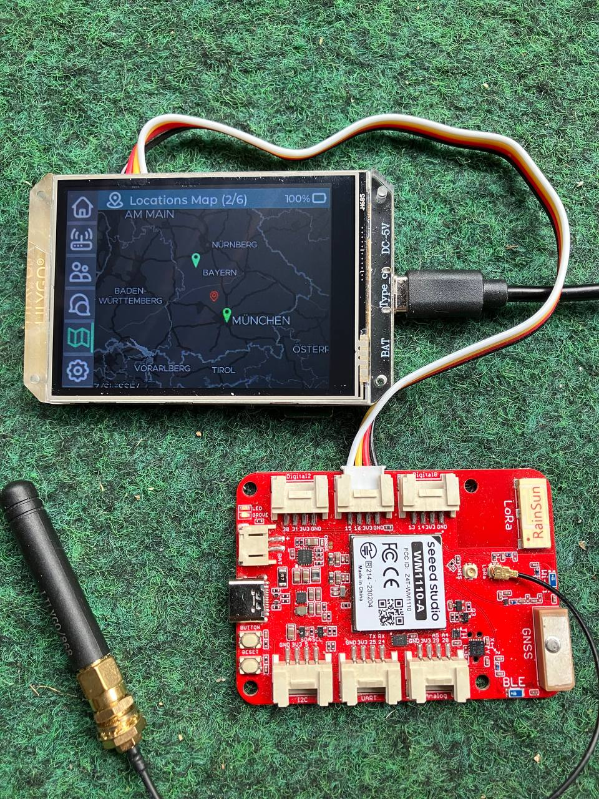
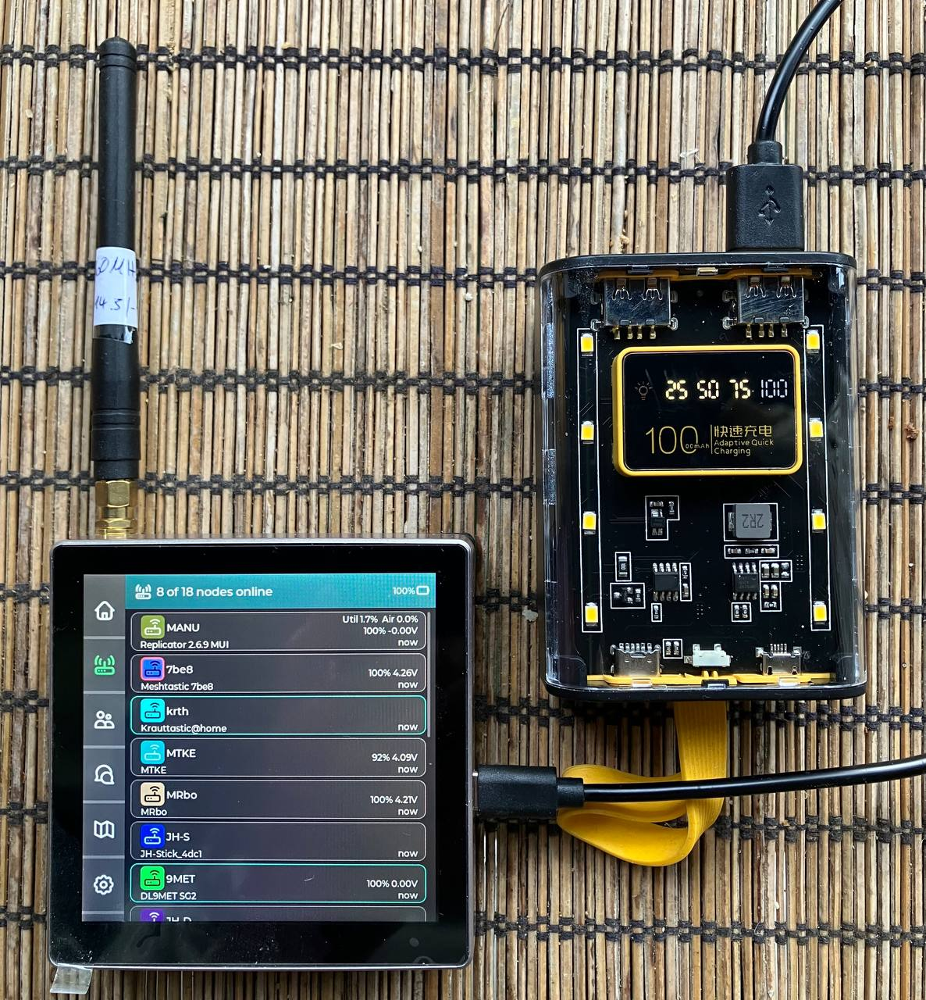
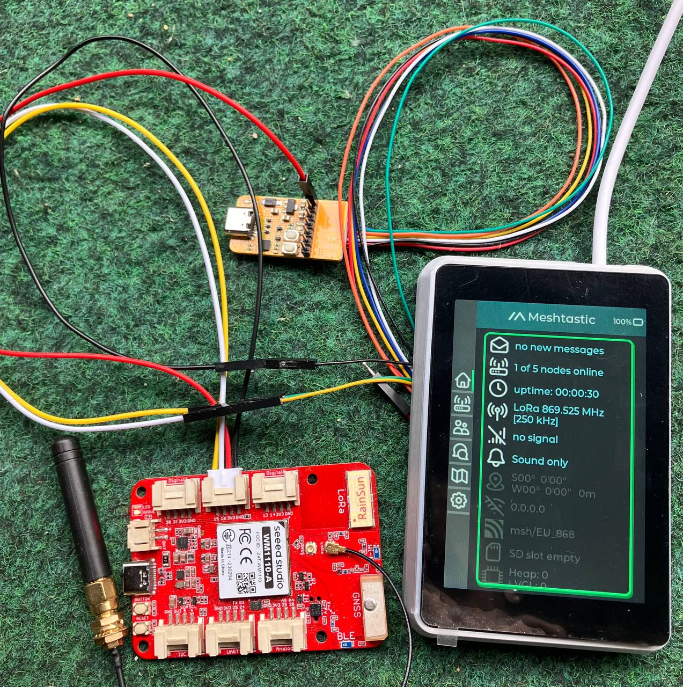
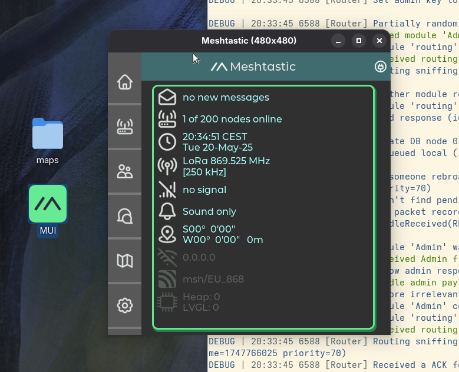

#

<div align="center">


  <h1 align="center"> Meshtastic Standalone UI</h1>
  <p style="font-size:20px;" align="center">A versatile UI for the <a href="https://meshtastic.org">meshtastic® project</a> </p>
</div>

<!--Project specific badges here-->

<p align="center">
<a href="">
    </a>
    <a href="https://github.com/meshtastic/device-ui/issues">
    </a>
  <a href="https://opencollective.com/meshtastic">
    
  </a>
</p>

<p align="center">
Vectors and icons by <a href="https://www.svgrepo.com/" target="_blank">SVG Repo</a><br>
Graphics using <a href="https://lvgl.io/" target="_blank">LVGL</a> library
</p>

## :wave: Introduction

### PlatformIO projects for standalone display devices

This repository provides firmware source code for the following MUI devices and scenarios:

<p style="text-align:center;">

- LilyGo T-HMI 2.8inch TFT (esp32-s3) - serial
- ESP32-4848S040 4.0inch TFT (esp32-s3) - serial
- WT32-SC01 Plus 3.5inch TFT (esp32-s3) - serial
- Native linux X11 local/remote application - ethernet TCP/IP



</p>

## :computer: Build & Flash

Please follow the prerequisites for setting up the <a href="https://meshtastic.org/docs/development/linux" target="_blank">Linux Development Environment</a> and the general <a href="https://meshtastic.org/docs/development/firmware/build/" target="_blank">build instructions.</a><br>
Then either install a <a href="https://meshtastic.org/docs/hardware/devices/linux-native-hardware/" target="_blank"> Linux native device</a> or use a esp32-s3 TFT device connected to a LoRa device via serial .<br><br>
Finally build the MUI standalone firmware using a linux terminal as follows:

```bash
# checkout the repository from github
git clone --depth=1 --recursive https://github.com/mverch67/device-ui-project
cd device-ui-project

# activate the pio environment
source $HOME/.platformio/bin/penv/activate

# build and optionally upload the target(s) to your device(s)
pio run -e t-hmi-mui -t upload
pio run -e diy-replicator-mui -t upload
pio run -e wt32-sc01-plus-mui -t upload

# when connecting to another LoRa device its serial interface must be configured:
meshtastic --set serial.enabled true --set serial.baud 38400 --set serial.mode PROTO
# please configure the right GPIO serial ports for rx/tx, e.g. for RAK4631
meshtastic --set serial.rxd 8 --set serial.txd 6

# build the native MUI
pio run -e native-mui

# install MUI desktop icon
mkdir -p $HOME/.icons $HOME/.local/share/applications $HOME/.local/bin
cp etc/MUI.desktop $HOME/.local/share/applications
cp etc/MUI.png $HOME/.icons
cp .pio/build/native-mui/program $HOME/.local/bin/native-mui

# run MUI native from CLI to connect to meshtasticd daemon
.pio/build/native-mui/program
```

## Stats


